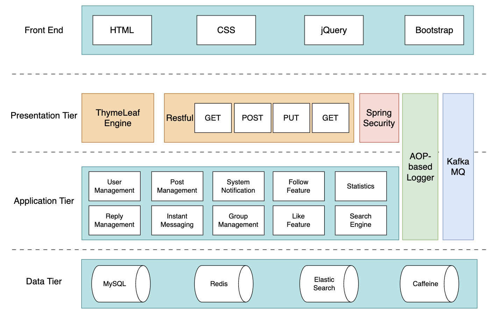
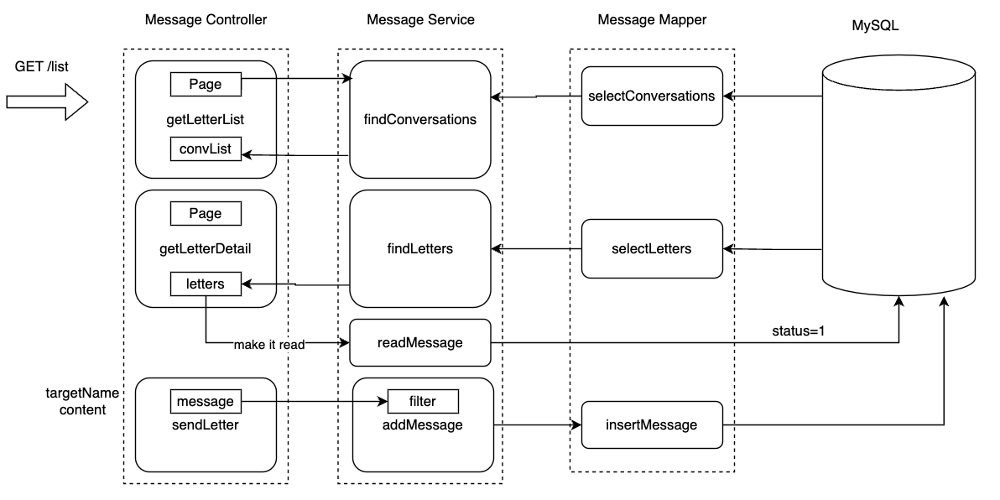
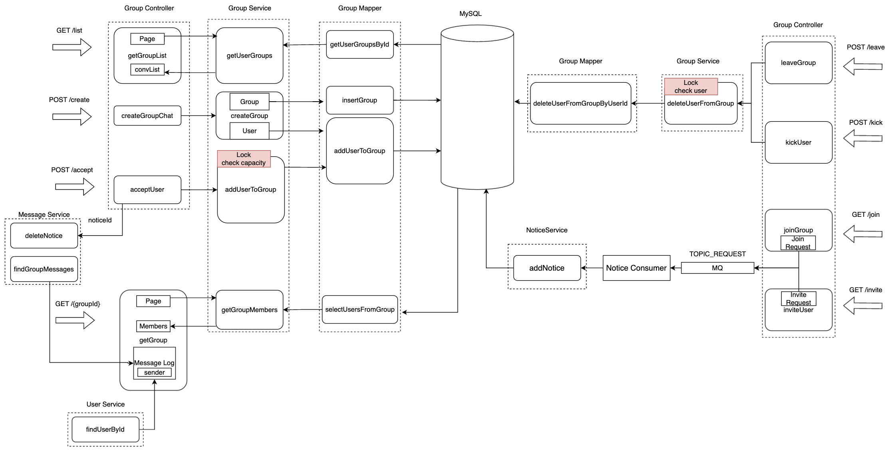

# WeCommunity
> With a name like this, you know it’s a social media community! That’s right—this is a place to meet new friends and share what’s fresh and exciting! Here, you can explore all kinds of fun posts from community members, follow them, start conversations you won’t want to end, and even jump into lively group chats with everyone!

WeCommunity is a user sharing and chatting platform, similar to social media, providing post management, comments, followers, likes, search, instant messaging, group chat, statistics and other features.

[Explore Here!](http://weco.us-east-2.elasticbeanstalk.com/wecommunity/index)

### Accounts for you to use in case you don't want to register one:

username&password: aaa

username&password: bbb

username&password: ccc

### System Architecture Diagram

### Feature Description

1. User Management

   &emsp;&emsp;Users can register, log in, log out, change their avatar, view a user's homepage, which includes a user's followers, followees, number of likes they have received, posts they have made, and the users themselves can view the comments they have made.

2. Post Management

   &emsp;&emsp;Ordinary users can post and modify posts, administrators can delete posts and restore deleted posts, and moderators can stick/unstick as well as pin/unpin posts.

3. Follow Feature

   &emsp;&emsp;Users can follow/unfollow a user, if A follows B, then A has B in his follow list and B has A in his followee list.

4. Reply Management

   &emsp;&emsp;Users can comment on posts and also reply to comments.

5. Like Feature

   &emsp;&emsp;Users can like posts, comments.

6. System Notification

   &emsp;&emsp;When a user comments, likes a post, or follows a user, then the user who was commented, liked, or followed receives a notification. In addition, when a group owner invites someone or a user requests to join a group, the invited person and the group owner will receive a notification. Currently there are 4 types of notifications in the system: comment notification, like notification, followed notification, and group request/invitation notification.

7. Statistics

   &emsp;&emsp;Administrators can view UV (unique visitors) and DAU (daily active users) data for a specified date range of the website.

8. Instant Messaging

   &emsp;&emsp;Users can send private messages to other users within the site, where both parties send messages to each other and only they themselves can see their private messages. The message push is instant.

9. Group Management

   &emsp;&emsp;Members of a group can chat. When a member sends a message, all other members can see the message. Each user can create a group chat. The group owner can invite other users to join the group. Users can also request the group owner to join the group chat.

10. Search Engine

    &emsp;&emsp;The search system is implemented using Elasticsearch, which supports searching for post titles, post content, as well as chat log.

### Tech Stack

- Spring Boot
- SpringMVC
- Spring
- MyBatis3: Database interaction
- Spring Security
- Redis cloud：Cache and Data Storage
- Kafka：Message Queue
- Elasticsearch：Distributed Search Engine
- Quartz：Timed Scheduling Framework
- Nginx
- Thymeleaf：Template Engine
- Caffeine：Java Local Cache
- MySQL
- AWS (Elastic Beanstalk, RDS, MSK)

### Interface Design

### Request-driven Data Flow Analysis of Each Module

#### Login

#### Follow and Like Feature

#### User Management

#### Notification Feature

#### Message Management

#### Instant Messaging

#### Group Management

#### Post and Comment Management

#### Http Request Flow

